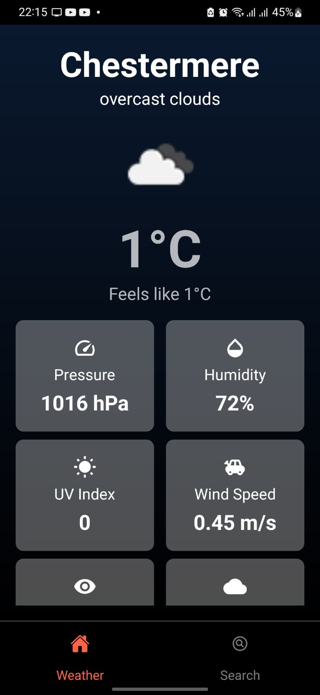
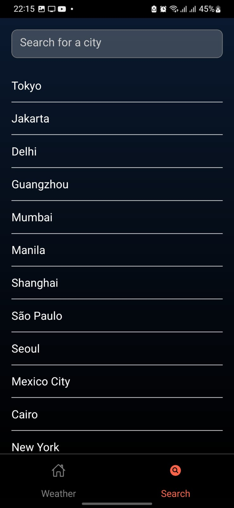
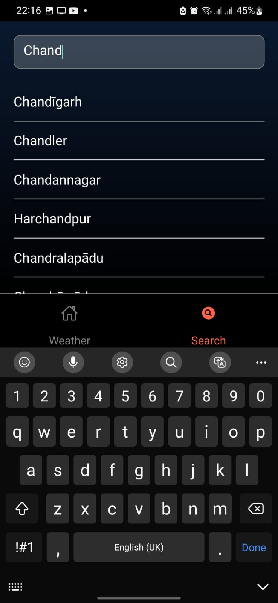
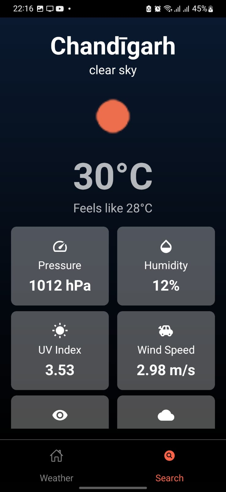

# Weather App

This is a weather application built with React Native. It provides real-time weather information based on the user's current location and allows users to search for weather details in different cities.

## Installation

After cloning the repo you need to tnstall Node using:

```npm init -y```

Before running the app, you need to install the necessary node modules and React Native dependencies. Run the following commands in your project directory:

```npm install```


or if you are using `yarn`, run:

```yarn install```

This will install all the dependencies in the `node_modules` folder that are defined in your `package.json`.

## Modules Required

Make sure to have the following modules installed:

- `@react-navigation/native`
- `@react-navigation/bottom-tabs`
- `@react-navigation/native-stack`
- `react-native-vector-icons`
- `react-native-linear-gradient`
- `@react-native-community/geolocation` (or `react-native-geolocation-service` if you prefer)
- `tailwind-rn`

To install these modules, you can run:

```npm install @react-navigation/native @react-navigation/bottom-tabs @react-navigation/native-stack react-native-vector-icons react-native-linear-gradient @react-native-community/geolocation tailwind-rn```

or with `yarn`:

```yarn add @react-navigation/native @react-navigation/bottom-tabs @react-navigation/native-stack react-native-vector-icons react-native-linear-gradient @react-native-community/geolocation tailwind-rn```


## Usage

After installing all the dependencies, you can start the app with:

```npx react-native run-android```

or

```npm run android```

## Screenshots

### Home Screen

*The Home Screen displays the current weather based on the user's location.*

### Search Bar

*The Search Bar appears at the top of the Search Screen.*

### Typing in Search Bar

*The app begins filtering results as you type in the search bar.*

### City Weather Details

*The Weather Details Screen shows up when a city is selected from the search results.*

## License

Include your license information here.